## About
* The aim of the project is to given an image, draw bounding box around blue recycling bins. The proposed method is to first segment the image and then use the 
segmented image to find out regions of interest using methods such as shape statistics and contours.  
* We build a Gaussian Discriminant Model and a Mixture of Gaussian model to segment an image into blue and non-blue regions. 
* A detector module then takes the segmented image as input, applies some morphology and smoothening operations on the segmented image. After that 
we apply open-cv findContour and boundingRect methods to get contours along the blue areas in the image. Combined with some shape statistics, we filter 
these regions into possible blue recycling bin regions and return the bounding boxes around these bins.

## Environment Setup
* To replicate the project, first build a conda environment using the provided ece276a.yaml file as follows : 
<pre> $conda env create -f ece276a.yaml</pre>
* Add the project path to PYTHONPATH environment variable as shown below : 
<pre> $export PYTHONPATH=$/path_to/ECE_276A_PR1_Submission/$ </pre>
* Finally activate the conda environment 
<pre> $conda activate ece276a </pre>

## File Details
Files are structured into two directories :- 
1. bin_detection : This directory contains all code files used to generate training data from the images using roipoly in the rgb and yuv space, 
train the Gaussian Discriminant Model and the Mixture of Gaussians Model, and get the bounding boxes to the blue recycling in the image.

<pre>
bin_detection/
├── bin_detection_rgb.pkl
├── bin_detection_ycrcb.pkl
├── bin_detector.py
├── gaussian_classifier.py
├── generate_color_data.py
├── generate_ycrcb_data.py
├── __init__.py
├── mog.py
├── mog_rgb.pkl
├── mog_yuv.pkl
├── requirements.txt
├── roipoly
│   ├── __init__.py
│   ├── roipoly.py
│   └── version.py
├── test_bin_detector.py
└── test_roipoly.py
</pre>

###  a. generate_color_data.py: 
This script is used to generate rgb pixels using roipoly from the given images. We draw two regions of interest : a positive region containing blue 
recycling bin pixels and a negative region containing blue pixels not belonging to a recycling bin and other colored objects. 
### b. generate_ycrcb_data.py: 
This script is the same as generate_color_data.py, except that this generates the pixels in YUV space. 
### c. gaussian_classifier.py : 
This script is used to train a single gaussian discriminant model on the positive and negative class examples. Usage :
 <pre>
 $python3 bin_detection/gaussian_classifier.py
 </pre>
### d. mog.py
This script is used to train a mixture of gaussian model on the positive and negative class examples. Since expectation maximisation is a complex 
algorithm, the model is trained on a minibatch once at a time. There are hence two modes of using this script : to train a model from the scratch(Mode 1) or to train a saved model using a new minibatch of data(Mode 2). Additionally, we need to give it an input x mentioning from which point we are picking up the data to train the model. Usage : 
<pre>
$python3 bin_detection/mog.py 1000 1  %Start training from scratch from 1000th data point
$python3 bin_detection/mog.py 10000 2 %Continue training previously saved model from 10000th data point
</pre>

### e. bin_detector.py: 
This is the main script that is called to get the segmented image and the bounding box of the blue bins in the given image. This code defines a class that has the methods segment_image and get_bounding_boxes that are used to get the masked image and the bounding boxes around the blue bins respectively. Set color_space 
either to 'rgb' or 'yuv' and mode to 1 or 2 in the line 15 of this script. Mode 1 runs a single Gaussian Discriminant model whereas mode 2 runs a Mixture of 
Gaussians model. Usage : 
<pre>
$python3 bin_detection/bin_detector.py
</pre>

2. pixel_classification : This directory contains all code files to classify given pixel as a red, green or blue pixel. 

<pre>
pixel_classification/
├── gaussian_classifier.py
├── generate_rgb_data.py
├── __init__.py
├── parameters.pkl
├── pixel_classifier.py
├── requirements.txt
└── test_pixel_classifier.py
</pre>

### a. gaussian_classifier.py
This script is used to train a single gaussian discriminant model on the red, green and blue class examples. Usage : 
<pre>
$python3 pixel_classifier/gaussian_classifier.py
</pre>

## 3. run_tests.py
This script can be used to compute the overall score of pixel classification and bin detection on the provided validation set. Usage : 
<pre> $python3 run_tests.py </pre>
<pre>
color space : rgb
Mode : Mixture of Gaussians
{
    "tests": [
        {
            "name": "Bin Detection",
            "score": 10.0,
            "max_score": 10.0,
            "output": "Bin Detection score : 10.0\n"
        },
        {
            "name": "Pixel Classifier",
            "score": 10.0,
            "max_score": 10.0,
            "output": "Pixel classification score : 10.0\n"
        }
    ],
    "leaderboard": [],
    "visibility": "visible",
    "stdout_visibility": "hidden",
    "execution_time": "42.22",
    "score": 20.0
}
</pre>

## Technical Report
* [Sambaran Ghosal. "Color Segementation and Object Detection" Feb 2022](report/ColorSegmentationAndBinDetection.pdf)

## Results

### Case 1:

  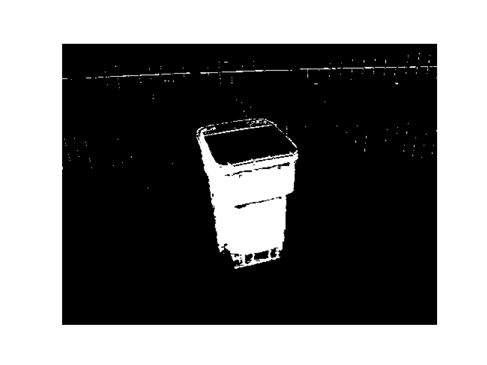
  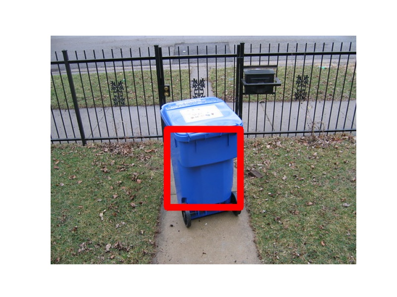 

### Case 2:

  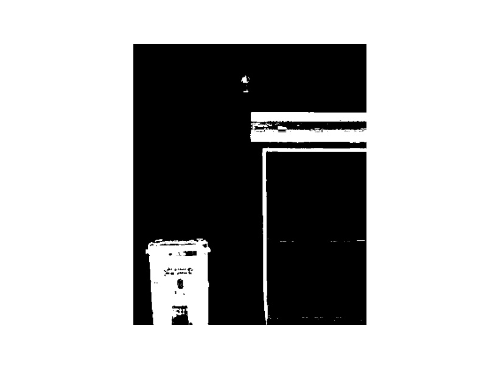
  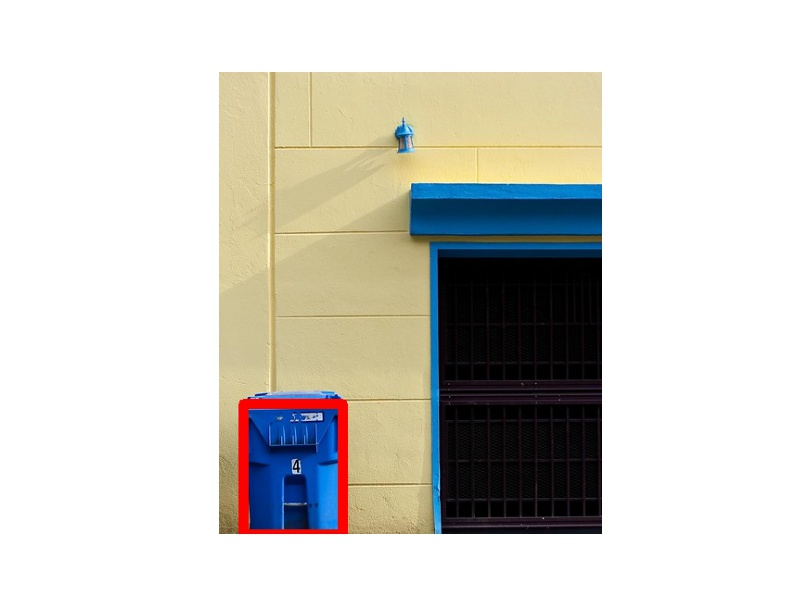 

### Case 3:

  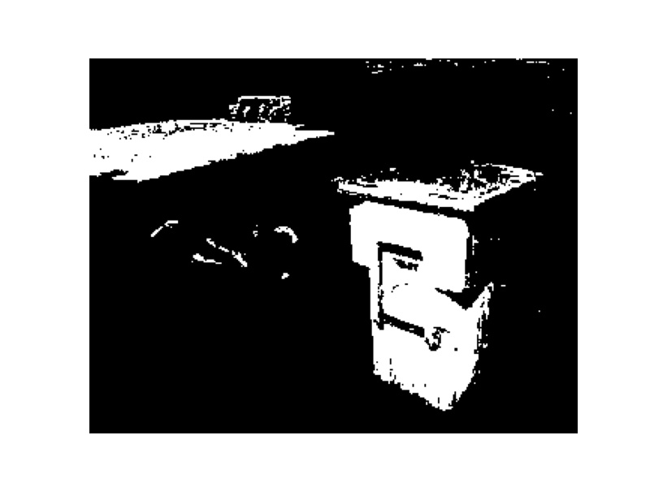
  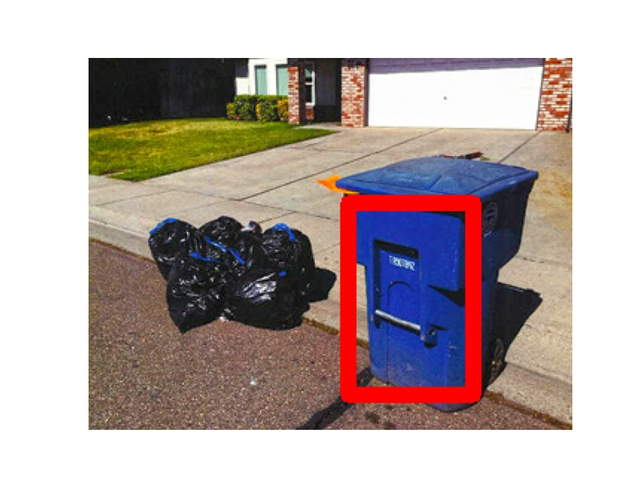 

### Case 4:

  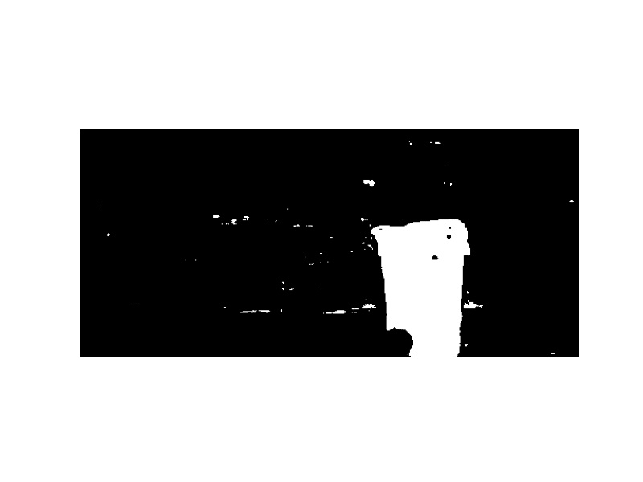
  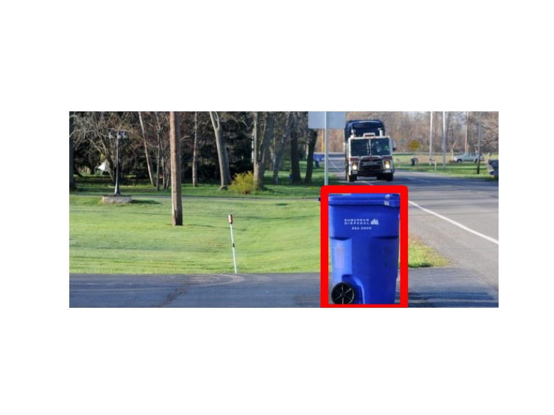 

### Case 5:

  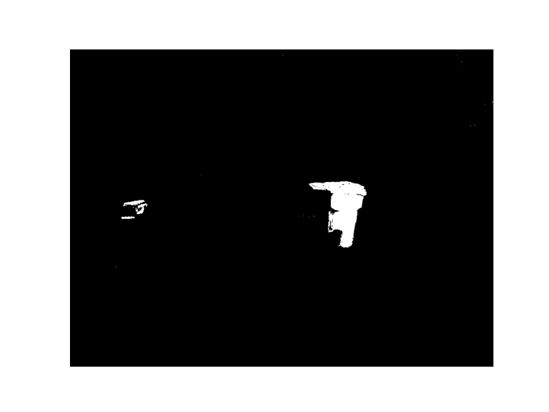
  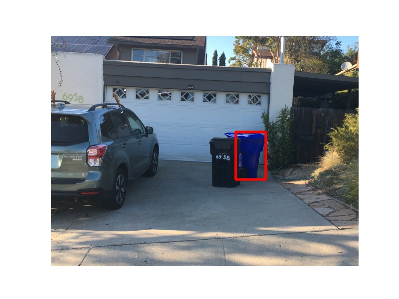 

### Case 6:

  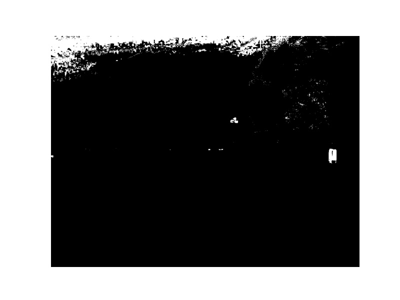
  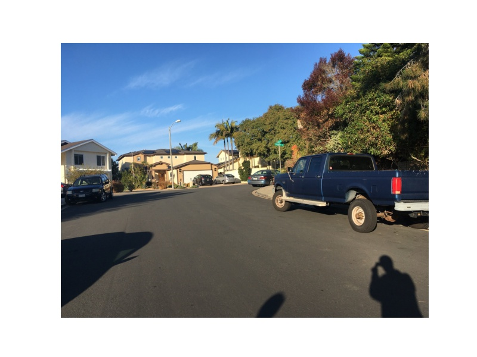 

### Case 7:

  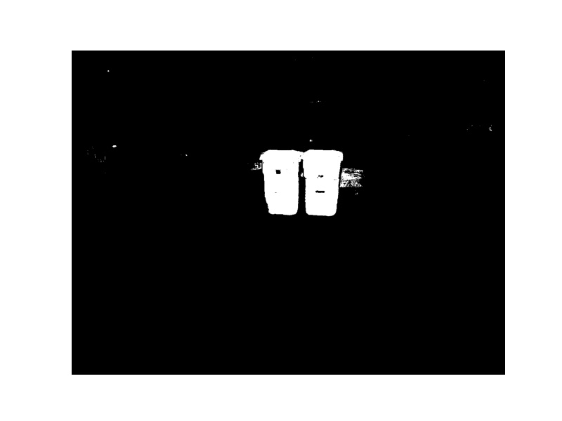
  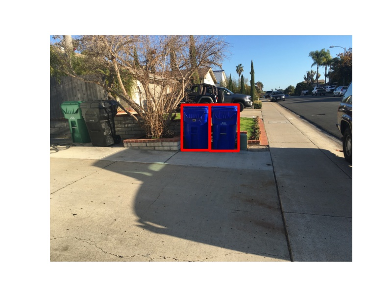 

### Case 8:

  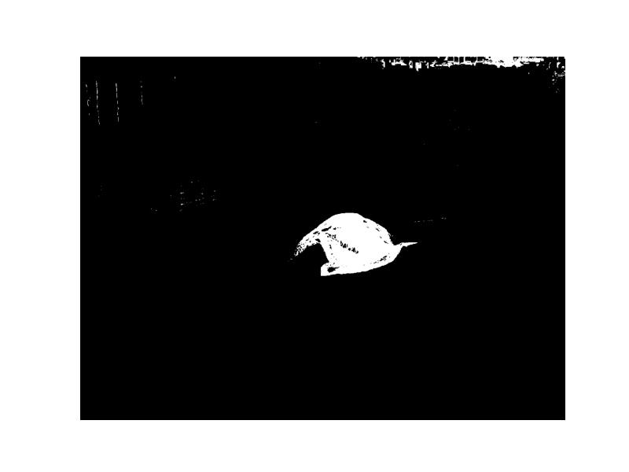
  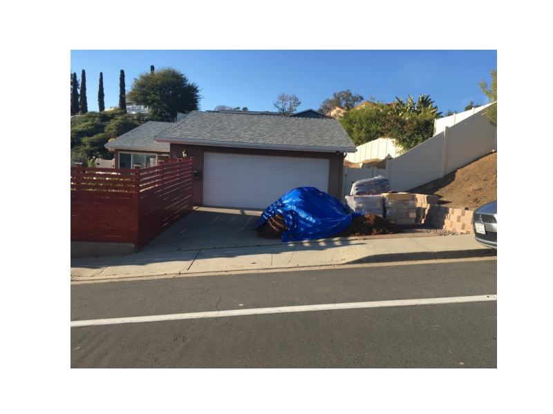 

### Case 9:

  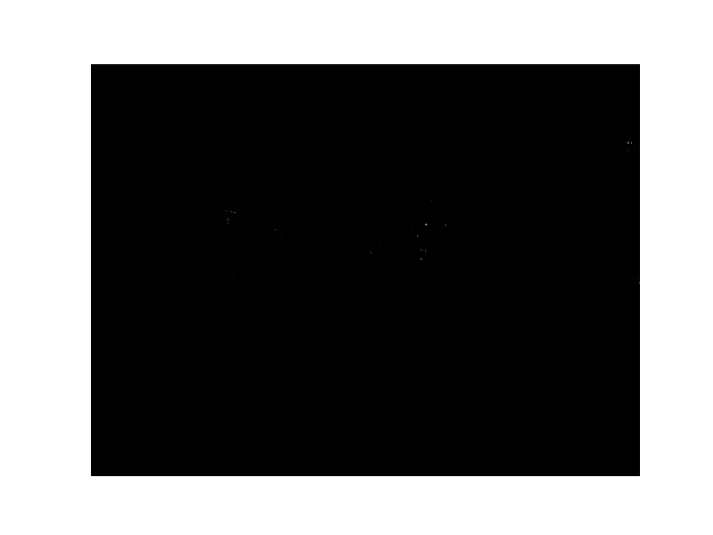
  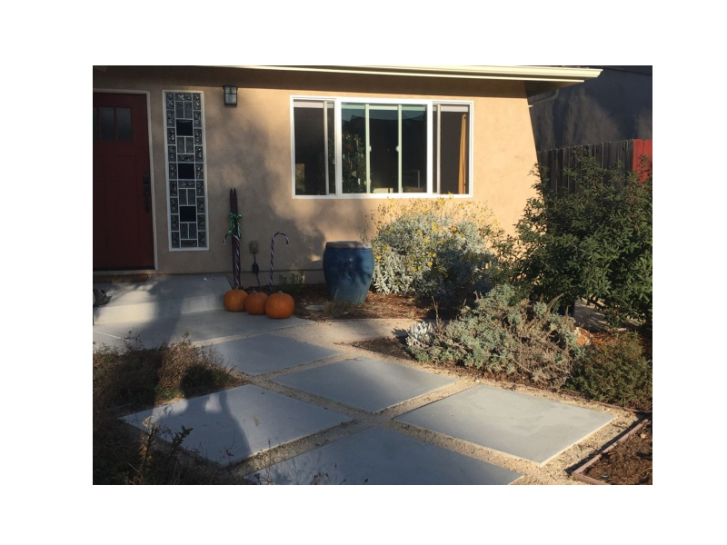 

### Case 10:

  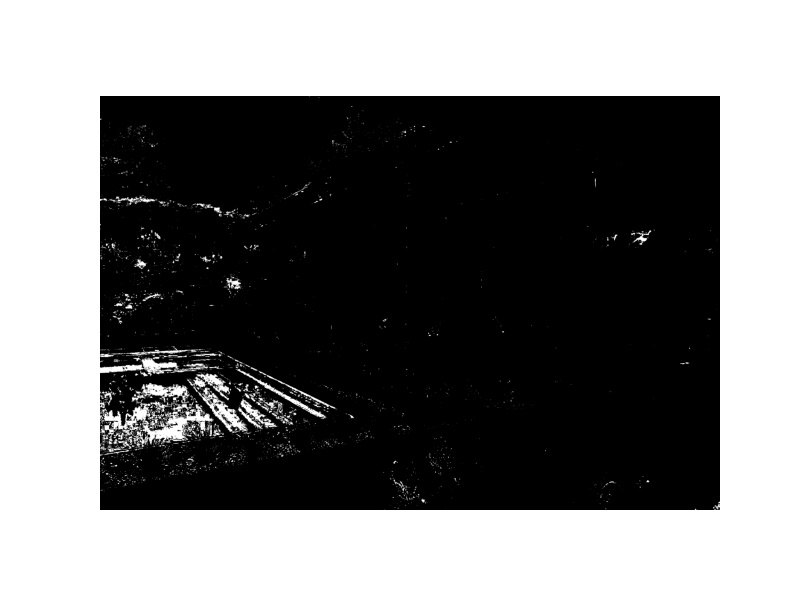
  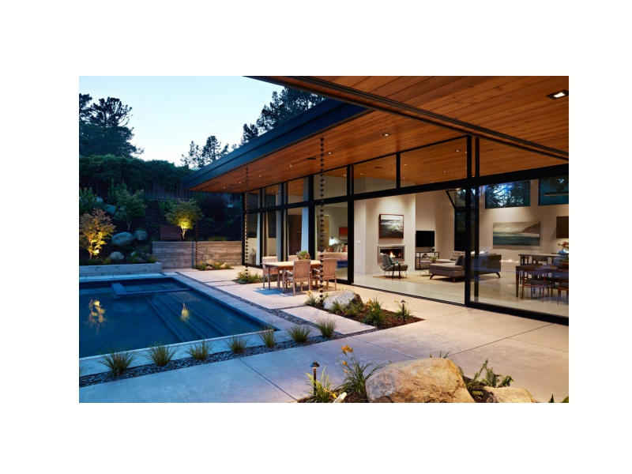 

